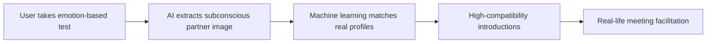

# Unison — Science-Based Dating & Relationship Generation System

> 🚀 *A revolutionary matchmaking platform powered by imprinting psychology and machine learning*

🌐 **Website**: [unison.dating](https://unison.dating/)  
📧 **Contact**: [unisondating@gmail.com](mailto:unisondating@gmail.com) 

---

## 📋 Table of Contents
- [Problem Statement](#-problem-statement)
- [Why Current Dating Apps Fail](#-why-current-dating-apps-fail)
- [Our Solution: The Unison Approach](#-our-solution-the-unison-approach)
- [Market Opportunity](#-market-opportunity)
- [Competitive Analysis](#-competitive-analysis)
- [Product Principles](#-product-principles)
- [MVP Validation & Metrics](#-mvp-validation--metrics)
- [Business Model](#-business-model)
- [Roadmap & Go-to-Market](#-roadmap--go-to-market)
- [Team](#-team)
- [Investment Opportunity](#-investment-opportunity)
- [Appendix: Market Data & Trends 2026](#-appendix-market-data--trends-2026)

---

## ⚠️ Problem Statement

### Global Context
- **2.1+ billion** single people worldwide seek meaningful relationships
- **323 million** actively use online dating apps, yet most fail to find lasting connections
- In Russia alone: **44.9 million people live alone** — over 30% of the population

### The Core Issue
> Modern dating apps are effective for only ~10% of the most conventionally attractive users. The remaining ~90% cycle through platforms hoping for better results, creating a cycle of frustration and churn.

### User Experience Asymmetry
```
📊 The 80/20 Imbalance:
• 80% of men compete for attention from 20% of women perceived as "least attractive"
• 80% of women compete for attention from 20% of men perceived as "most attractive"
```
This structural imbalance means attention concentrates on a small subset of users, rendering most platforms ineffective for the majority.

---

## 🎮 Why Current Dating Apps Fail

### 1. Designed for Engagement, Not Connection
Paradoxically, most dating services are **not built for dating**. Their real goals:
- Maximize time spent swiping, liking, and searching
- Encourage frequent returns and spending on premium features
- Create a "gamified" experience that keeps users hooked — not paired

> *"It's a game of dating that lonely people suffer from."*

### 2. Addictive & Potentially Harmful Mechanics
Platforms like Tinder and Bumble employ controversial monetization strategies:

| Mechanic | Description | Ethical Concern |
|----------|-------------|----------------|
| **Elo Rating / Social Ranking** | Algorithms rank user "quality" to control visibility and subscription pricing | Creates inequality; penalizes average users |
| **"Surprise Mechanics"** | Randomized rewards similar to loot boxes | Banned in EU by gambling regulator KSA |
| **Artificial Scarcity** | 12-hour cooldowns on right-swipes | Exploits FOMO (Fear Of Missing Out) |
| **Illusion of Infinite Choice** | Endless profile feeds | Triggers BoMO (Fear of Missing Out on Better) |

### 3. Repetitive, Demoralizing User Journey
Most apps follow the same frustrating loop:
```
Register → Browse limited profiles → Message a few → Disappointing matches → Burnout → Return later
```

---

## 🧪 Our Solution: The Unison Approach

### 🔬 Science-First Matchmaking
Unison leverages **imprinting** — a scientifically validated psychological mechanism that shapes our subconscious preferences for partners. 

> 💡 *"Love at first sight" is imprinting in action.*

### How It Works


### Key Differentiators
✅ **Evidence-based**: Algorithm grounded in peer-reviewed imprinting research [[29-36]]  
✅ **Subconscious-first**: We extract ideal partner imagery from the unconscious mind  
✅ **Emotion-aware testing**: Proprietary assessment measures emotional responses, not just preferences  
✅ **ML-powered matching**: Advanced algorithms find real people whose profiles align with subconscious templates  
✅ **2–2.5× better effectiveness**: Early metrics show significantly higher match-to-meetup conversion  

### Why This Resonates
- The concept of "digital subconscious matching" creates strong product-market fit
- Users are increasingly skeptical of superficial swiping — they crave meaningful, science-backed connections
- Unison offers a fresh narrative: *"Let algorithms make the best decision for your heart"*

---

## 🌍 Market Opportunity

### Dating App Market Size (2026 Estimates)
| Source | Market Value | CAGR | Projection |
|--------|-------------|------|-----------|
| IndustryARC | $10.38B by 2026 | 4% | 2021–2026 [[1]] |
| ResearchAndMarkets | $10.77B (2026) → $15.35B (2030) | 9.3% | 2026–2030 [[2]] |
| Mordor Intelligence | $7.79B (2026) → $13.57B (2031) | 11.76% | 2026–2031 [[3]] |
| MSM Coretech | >$12B revenue expected by end of 2026 | — | [[7]] |

### Key Trends Shaping the Industry
🔹 **AI-Powered Matchmaking**: Apps increasingly use behavioral analysis and predictive compatibility scoring [[20]][[25]]  
🔹 **Intentional Dating**: Shift away from swipe fatigue toward curated, relationship-focused experiences [[28]]  
🔹 **Retention Focus**: Day-1 retention improved to 26% in 2025 (up from 24% in 2024) [[Adjust Blog]]  
🔹 **Rising Acquisition Costs**: CPI jumped from $1.46 (2024) to $2.76 (2025), making organic/PR-driven growth critical [[Adjust Blog]]  
🔹 **Safety & Ethics**: Growing demand for transparent algorithms and bias mitigation [[20]]

> 💡 *Unison's PR-first, sub-$1 CPI user acquisition strategy directly addresses rising paid channel costs.*

---

## ⚔️ Competitive Analysis

| Feature | **Unison** | Tinder | Badoo |
|---------|-----------|--------|-------|
| Public profiles | ✅ Optional | ✅ Default | ✅ Default |
| Inactive profile filtering | ✅ Yes | ❌ No | ❌ No |
| Catalog/search/swipe | ❌ No | ✅ Yes | ✅ Yes |
| Mobile app | ✅ Yes | ✅ Yes | ✅ Yes |
| Messenger chatbot | ✅ Yes | ❌ No | ❌ No |
| **Imprint-based matching** | ✅ **Core IP** | ❌ No | ❌ No |
| Science-backed psychology | ✅ Yes | ❌ No | ❌ No |
| Focus on real-world meetings | ✅ Primary goal | ❌ Engagement-first | ❌ Engagement-first |

### Strategic Positioning
Unison doesn't compete on features — we compete on **philosophy**:
> *"A dating service should actually introduce people — not pretend to."*

---

## 🎯 Product Principles

Every Unison feature is built on five core tenets:

1. **Authentic Connection** → Facilitate real introductions, not endless browsing  
2. **Equitable Opportunity** → Every user deserves a fair chance to find partnership  
3. **Relationship Nurturing** → Tools to strengthen connections *after* the match  
4. **Safety & Comfort** → Zero tolerance for harassment; transparent data practices  
5. **Love-Centric Design** → Every interaction serves the goal of meaningful relationships  

---

## 📊 MVP Validation & Key Metrics

Our MVP engaged **6,000+ users** and demonstrated strong product-market signals:

| Metric | Unison Result | Industry Benchmark |
|--------|--------------|-------------------|
| **Real-life meetup intent** | >20% of matched users | <5% (typical apps) |
| **Female engagement lift** | 2.5× higher than male | Gender parity typical |
| **ROAS (Russia campaign)** | >30% positive | Varies widely |
| **Retention D1** | 44% | ~26% industry avg [[Adjust]] |
| **Retention D7** | 35% | ~12% industry avg [[Adjust]] |
| **Payer ratio (M:F)** | ~1:1 | Often skewed male-heavy |

📈 *Retention curve shows slow decay post-D7 — indicating strong early product stickiness.*

🔗 [View MVP Dashboard](https://s3-us-west-2.amazonaws.com/secure.notion-static.com/1f68efa2-a528-429b-a39d-a7930e6e50f3/Unison_Dating_(Dashboard_with_MVP_test_scores).pdf)

---

## 💼 Business Model

A refined, multi-revenue-stream approach validated by market leaders:

```
💰 Revenue Streams:
├─ Premium Subscriptions → Faster, priority matching
├─ Digital Goods → Gifts, stickers, NFT collectibles
├─ Contextual Advertising → Venues, experiences, relationship services
└─ Couple Features → Post-match engagement tools (retention + monetization)
```

### Why This Works Now
✅ Post-pandemic demand for *real-world* connection is surging  
✅ Economic uncertainty drives people to seek supportive partnerships  
✅ Online dating has proven recession-resilient (2008, 2020 data)  
✅ Users are fatigued by gamified apps — ready for science-backed alternatives  

### Future Expansion Opportunities
🔸 **Couples Toolkit**: Relationship check-ins, shared goals → boosts LTV  
🔸 **Virtual Spaces**: Safe, themed video environments for first dates  
🔸 **Emotional Wellness**: Optional mood/relationship tracking as a habit-forming feature  

---

## 🗓️ Roadmap & Go-to-Market Strategy

### Phase 1: Tier-1 Market Entry (Months 1–3)
- Launch with fresh, science-forward PR narrative  
- ASO optimization + organic growth focus  
- Target: **< $1 CPI** via earned media and community building  
- Goal: **100,000+ app installs** in first 90 days  

### Phase 2: Scale & Monetize (Months 4–12)
- Reinvest early revenue into performance marketing  
- Activate premium features and digital goods  
- Expand to adjacent English-speaking markets  

### Phase 3: Ecosystem Growth (Months 13–18)
- Launch couple-focused features to reduce churn  
- Explore B2B partnerships (events, counseling, lifestyle brands)  
- Target: **Self-sustainability** within 12–18 months  

📊 [Financial Projections (Google Sheets)](https://docs.google.com/spreadsheets/d/1p3EvkG7b2Xa-59TibGnL1T7MBi8pyvpciY_OG5vJl9M/edit?usp=drivesdk)

---

## 👥 Team

| Name | Role | Background |
|------|------|-----------|
| **Sergey Sigito** | Co-Founder, Product | Ex-Product Director @ Mamba (Eastern Europe's largest dating platform); scaled from 1M → 40M users; +142% ARPU growth |
| **Maksim Shcheglov** | Co-Founder, Marketing | Founder of Promenad (North America); managed $100K+/mo ad budgets in Tier-1 markets |
| **Boris Soldatov** | Co-Founder, Marketing | Lead of Pure (Woorldwide); Tier-1 app |

---

## 💰 Investment Opportunity

### Seeking: **$200,000** (Pre-Seed)
**Use of Funds**:
- 50% → Tier-1 market user acquisition (PR + ASO)  
- 30% → Product development (AI matching refinement, safety features)  
- 20% → Team expansion & operational runway  

### Target Outcome
✅ Reach self-sustainability within 12–18 months  
✅ Establish Unison as the category leader in *science-based dating*  
✅ Position for Series A or strategic acquisition  

### Ideal Investors
- Pre-seed funds or angels focused on:  
  - Consumer tech / social infrastructure  
  - AI/ML applications with ethical frameworks  
  - Markets: Russia, CIS, then global English-speaking  

---

## 📎 Appendix: Market Data & Trends 2026

### User Behavior Insights
- 51% of adults 18–29 and 53% of adults 30–49 have used dating apps [[16]]  
- 60% of dating app users are male, 40% female — but the gap is narrowing [[11]]  
- 26% of singles now use AI tools to enhance their dating experience [[24]]  

### Technology Trends
🔹 **AI Matchmaking**: Algorithms now analyze behavior, preferences, and micro-interactions for compatibility scoring [[20]][[25]]  
🔹 **Predictive Success Modeling**: ML forecasts relationship potential based on historical pattern analysis [[20]]  
🔹 **Conversation AI**: Chatbots suggest personalized icebreakers using shared interests [[20]]  
🔹 **Safety AI**: Real-time detection of scams, harassment, and inauthentic profiles [[20]]  

### Ethical Considerations
⚠️ **Privacy**: Transparent data collection and user consent are non-negotiable  
⚠️ **Bias Mitigation**: Regular algorithm audits to prevent demographic discrimination  
⚠️ **Authenticity**: Clear disclosure when AI assists interactions (no "bot baiting")  

### Seasonal Patterns (Valentine's Day 2025 Data)
- Dating apps saw only **+12% install lift** and **+4% session growth** pre-Valentine's [[Adjust Blog]]  
- Recipe, food delivery, and streaming apps outperformed dating apps in pre-holiday engagement  
→ *Opportunity: Position Unison as a year-round relationship builder, not just a holiday tool*

---

> 🌟 **Unison isn't another swipe app. It's a science-powered bridge from loneliness to lasting connection.**

---

*Last updated: March 2026*  
*Data sources: IndustryARC [[1]], ResearchAndMarkets [[2]], Mordor Intelligence [[3]], Adjust Blog, Statista, Peer-reviewed imprinting research [[29-36]]*  
